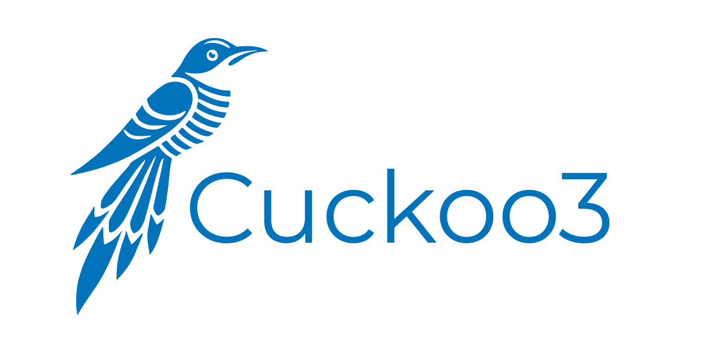

# Cuckoo 3 documentation

## Overview

Welcome to Cuckoo3!
Here you can find a brief overview of different parts of the documentation.

- [About](about/cuckoo.md) - Covers the basics about Cuckoo, sandboxing and 
dependencies.
- [Installing Cuckoo3](installation/overview.md) - Guides you through how to 
install Cuckoo3.
- [Configuration](configuration/index.md) - Covers all related configurations 
and vm creation topics.
- [Virtual Machines](vms/index.md) - Explains how you can create and configure 
virtual machines.
- [Web](web/index.md) - Covers how to set up Cuckoo3 Django frontend.
- [Usage](usage/index.md) - Describes how to use various parts of Cuckoo.
- [Development](developer/index.md) - Developer focused section to create your 
own machineries.
- [Troubleshooting](faq/index.md) - List known problems and solutions to 
those problems.

## Links

You can Cuckoo3 it in action at our [online Cuckoo3 Sandbox](https://cuckoo-hatch.cert.ee/).  
For more insight into our plans, [check out our roadmap here](https://github.com/orgs/cert-ee/projects/1/views/1).
